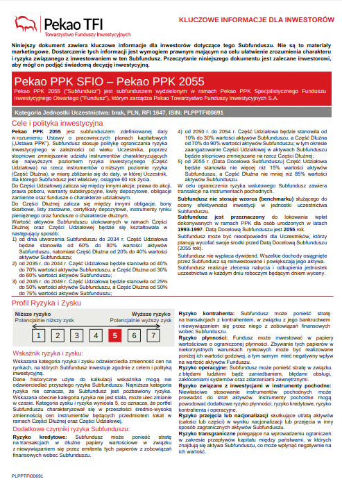
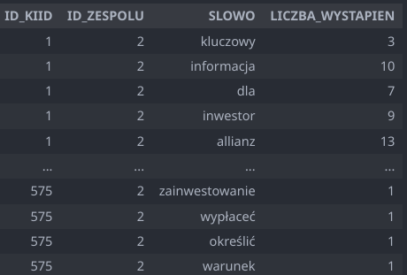
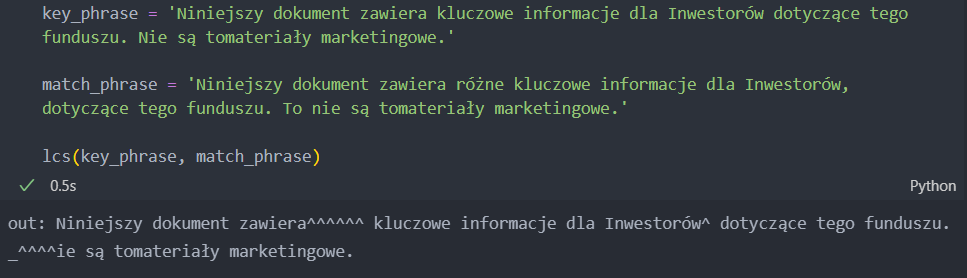

# 
 Pomysłowi   Inżynierowie   Wielkich   Okazji  

## 
 #KarateKIID 

---
# 
Problem

---

# 
Pobieranie danych

<ul>
    <li>Odwiedzenie jak największej liczby stron</li>
    <li>Algorytm DFS</li>
    <li>Niezależność od struktury strony</li>
    <li>~16000 plików w surowych danych</li>
    <li>~600 plików, które na pewno są KIIDami</li>
</ul>

---

# 
Przetwarzanie PDFów

<ul>
    <li>Podział na sekcje</li>
    <li>Ekstrakcja danych z tabel za pomocą konwersji <em>PDF -> HTML</em> </li>
    <li>Potencjalnie analiza wykresu za pomocą AI</li>
    <li>Dane w takiej postaci są dużo prostsze w dalszej obróbce</li>
</ul>

---

# 
Wyciąganie informacji z tekstu

<ul>
    <li>Spacy</li>
    <li>BeautifulSoup</em> </li>
    <li>Imputacja brakujących danych przy użyciu zewnętrznych źródeł</li>
</ul>

---
# 
Bag of words

---

# 
Weryfikacja wymaganych fraz

<ul>
    <li>zmodyfikowany algorytm wyszukiwania najdłuższego wspólnego podciągu</li>
    <li>odporny na odmianę słów</li>
    <li>dodatkowo, tworzy intuicyjne wizualizacje pokazujące różnice między tekstami</li>
     
    
</ul>

---

# 
Nasze sukcesy

<ul>
  <li>Bardzo dokładny scrapping niezależny od zmian w strukturze strony</li>
  <li>Poprawnie przeprowadzone Bag of Words</li>
  <li>Dobrze zorganizowany i rozszerzalny kod</li>
  <li>Poprawne wyciąganie wielu kolumn</li>
  <li>Korzystanie z zewnętrznych danych</li>
</ul>

---

# 
Co pozostało do realizacji

<ul>
  <li>Niepoprawne wyciąganie wartości dla niektórych kolumn np. "IDENTYFIKATOR_KRAJOWY"</li>
  <li>Optymalizacja procesu wyciągania danych z tekstu KIIDa</li>
  <li>Wyciąganie danych o opłatach z tabeli</li>
  <li>Wyciąganie danych o stopie zwrotu z wykresów</li>
</ul>

